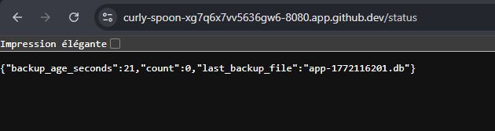

# 🛡️ Mini-PRA Kubernetes – Atelier PCA / PRA

## 📌 Objectif de l’atelier

Cet atelier met en œuvre un mini Plan de Reprise d’Activité (PRA) sur Kubernetes en déployant une application Flask avec une base SQLite persistée sur un volume Kubernetes.

Nous démontrons concrètement :

- 🔄 La différence entre PCA (Continuité d’Activité) et PRA (Reprise après sinistre)
- 📦 Le rôle des PVC (Persistent Volume Claims)
- ⏱️ La mesure des RTO (Recovery Time Objective) et RPO (Recovery Point Objective)
- 🧠 Les limites d’une architecture locale non répliquée

---

# 🏗️ Architecture cible

## 🔹 Composants principaux

- Application Flask (container Docker)
- Base SQLite
- PVC `pra-data` (stockage production)
- PVC `pra-backup` (stockage sauvegardes)
- CronJob Kubernetes (backup toutes les minutes)
- Job de restauration
- Cluster K3d (1 master + 2 workers)
- Image Docker construite avec Packer
- Déploiement orchestré avec Ansible

---

# 🚀 Déploiement réalisé

## 1️⃣ Création de l’environnement

- Création d’un cluster K3d (1 master / 2 workers)
- Installation de :
  - Packer
  - Ansible
  - kubernetes.core

## 2️⃣ Build de l’image

```bash
packer init .
packer build -var "image_tag=1.0" .
```

Image générée :

pra/flask-sqlite:1.0

Import dans le cluster :

```bash
k3d image import pra/flask-sqlite:1.0 -c pra
```

## 3️⃣ Déploiement Kubernetes

```bash
ansible-playbook ansible/playbook.yml
```

Création automatique :

- Namespace `pra`
- Deployment Flask
- Service
- PVC `pra-data`
- PVC `pra-backup`
- CronJob `sqlite-backup`
- Job de restauration

---

# 🎬 Scénario 1 — PCA : Crash du Pod

## 🔥 Action

```bash
kubectl delete pod <nom-du-pod>
```

## ✅ Résultat

- Kubernetes recrée automatiquement un nouveau pod
- Les données sont intactes
- Aucune perte de message

## 🧠 Explication

Les données sont stockées dans un Persistent Volume Claim externe au pod.  
Le pod est stateless. Kubernetes remonte le PVC existant lors du redémarrage.

👉 Il s’agit d’un PCA (Plan de Continuité d’Activité)

- RTO ≈ 5 à 10 secondes
- RPO = 0

---

# 🎬 Scénario 2 — PRA : Perte du PVC pra-data

## 🔥 Phase 1 — Simulation du sinistre

```bash
kubectl scale deployment flask --replicas=0
kubectl patch cronjob sqlite-backup -p '{"spec":{"suspend":true}}'
kubectl delete pvc pra-data
```

Impact :

- Base de données détruite
- Application indisponible
- Perte des données de production

---

## ✅ Phase 2 — Restauration

Recréation de l’infrastructure :

```bash
kubectl apply -f k8s/
```

Restauration depuis le backup :

```bash
kubectl apply -f pra/50-job-restore.yaml
```

Réactivation des backups :

```bash
kubectl patch cronjob sqlite-backup -p '{"spec":{"suspend":false}}'
```

👉 Données restaurées avec succès.

---

# 📘 Exercices

## ✅ Exercice 1  
### Quels sont les composants dont la perte entraîne une perte de données ?

Les composants critiques sont :

- PVC `pra-data`
- PVC `pra-backup`
- Le stockage physique du node Kubernetes

La perte du pod ou du deployment n’entraîne PAS de perte de données.

---

## ✅ Exercice 2  
### Pourquoi n’avons-nous pas perdu les données lors de la suppression du pod ?

Car :

- Les données sont stockées dans un Persistent Volume Claim
- Le pod est stateless
- Kubernetes recrée le pod automatiquement
- Le nouveau pod remonte le PVC existant

La donnée est découplée du cycle de vie du container.

---

## ✅ Exercice 3  
### Quels sont les RTO et RPO ?

### PCA (Crash Pod)

- RTO ≈ 5 à 10 secondes
- RPO = 0

### PRA (Perte PVC)

- RTO ≈ 1 à 3 minutes
- RPO ≤ 1 minute (backup toutes les minutes)

---

## ✅ Exercice 4  
### Pourquoi cette solution n’est pas exploitable en production ?

Limites majeures :

- SQLite non adapté à forte charge
- Pas de réplication inter-node
- Backup stocké dans le même cluster
- Pas de stockage objet externe
- Pas de monitoring
- Pas de chiffrement des sauvegardes
- Pas de réplication géographique
- Pas de haute disponibilité base de données

Il s’agit d’un PRA local pédagogique, pas industriel.

---

## ✅ Exercice 5  
### Architecture plus robuste proposée

Améliorations :

1. Base de données :
   - PostgreSQL en cluster (Patroni / RDS / Cloud SQL)

2. Stockage :
   - Stockage distribué (EBS / GCE / Ceph)

3. Sauvegardes :
   - Backup vers stockage objet (S3)
   - Outil type Velero

4. Réplication :
   - Multi-zone
   - Multi-région

5. Monitoring :
   - Prometheus + Grafana

6. Sécurité :
   - Chiffrement des volumes
   - Chiffrement des backups
   - Gestion des secrets Kubernetes

---

# 🛠️ Atelier 1 — Route /status

Route ajoutée :

GET /status

Réponse JSON :

```json
{
  "count": 12,
  "last_backup_file": "backup-2025-01-10-12-00.db",
  "backup_age_seconds": 42
}
```

Fonctionnement :

- Lecture du nombre d’éléments en base
- Lecture du dernier fichier dans `/backup`
- Calcul de son âge en secondes

---

# 🛠️ Atelier 2 — Choisir son point de restauration

## 📖 Runbook de restauration

### Étape 1 — Lister les backups

```bash
ls -lh /backup
```

Identifier le fichier souhaité.

### Étape 2 — Suspendre l’application

```bash
kubectl scale deployment flask --replicas=0
```

### Étape 3 — Modifier le Job de restauration

Adapter `50-job-restore.yaml` :

```yaml
cp /backup/backup-YYYY-MM-DD-HH-MM.db /data/app.db
```

### Étape 4 — Lancer la restauration

```bash
kubectl apply -f pra/50-job-restore.yaml
```

### Étape 5 — Redémarrer l’application

```bash
kubectl scale deployment flask --replicas=1
```

---

## Séquence 6 : Ateliers

**Objectif :** Ajouter une route `/status` renvoyant un JSON contenant le nombre d'événements, le nom du dernier backup et son âge en secondes.

**Procédure réalisée :**
1. **Modification du code Python (`app.py`) :** Ajout de la route `/status` avec les imports nécessaires (`os`, `glob`, `time`). Connexion à la base via `sqlite3` et lecture des fichiers dans `/backup`.
2. **Modification du déploiement (`deployment.yaml`) :** Montage du volume `pra-backup` dans le conteneur Flask au chemin `/backup`, avec le paramètre `readOnly: true` par mesure de sécurité.
3. **Déploiement :** Reconstruction de l'image Docker avec Packer et redéploiement via Ansible.

**Résultat :**



# 📊 Synthèse

| Élément | PCA | PRA |
|---------|------|------|
| Pod crash | Automatique | - |
| Perte base | Non | Oui |
| RTO | Très faible | Modéré |
| RPO | 0 | ≤ 1 minute |

---

# 🧠 Conclusion

Cet atelier démontre :

- La différence entre disponibilité et résilience
- L’importance du stockage persistant
- Le rôle fondamental des sauvegardes
- Les limites d’un PRA local

Il constitue une base pédagogique solide pour comprendre la continuité et la reprise d’activité dans Kubernetes.

---
